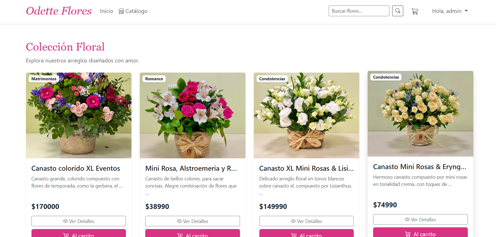
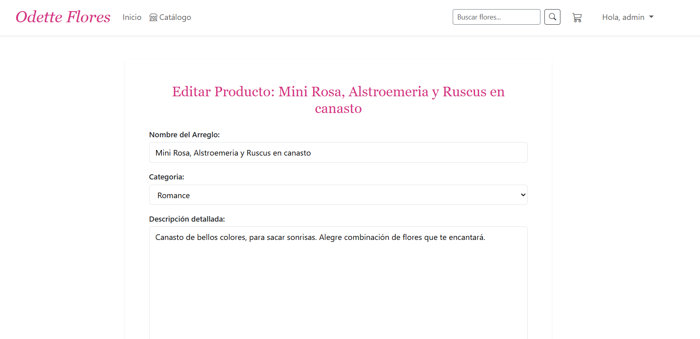

# 🌸 Boutique Floral Odette - E-commerce


Este proyecto es una plataforma de comercio electrónico desarrollada en Django para la venta de arreglos florales. Incluye gestión de inventario (por implementar), un carrito de compras persistente basado en sesiones y un sistema de roles y permisos personalizado.

**Enlace al Repositorio:** [https://github.com/OdetteAndrea/QM-DIGITAL/](https://github.com/TU-USUARIO/TU-REPOSITORIO)

## 📋MVP Final

### Motor de base de datos utilizado

- **SQLite3**: Base de datos relacional configurada por defecto en Django, utilizada para persistir el catálogo y transacciones en desarrollo.

### Descripción del modelo de datos

El sistema utiliza el ORM de Django con las siguientes entidades principales:

- **Categoria**: Modelo que clasifica los arreglos florales. Contiene los campos`nombre` y`descripcion`.
- **Producto**: Modelo principal del catálogo. Incluye`nombre`,`descripcion`,`precio` (validado > 0),`stock`,`imagen` y campos de fecha (`creado_en`,`actualizado_en`). Tiene una relación**Uno a Muchos (ForeignKey)** con la entidad`Categoria`.

### 🗺️ Rutas Principales

**Públicas:**

- `/` : Landing page (Inicio).
- `/catalogo/` : Catálogo general de productos.
- `/carrito/` : Vista y gestión del carrito de compras.
- `/login/` ,`/register/` : Inicio de sesión y registro de usuarios.

**Cliente (Requiere autenticación):**

- `/dashboard/` : Panel de control del cliente.
- `/mis-pedidos/` : Historial de compras procesadas.
- `/mis-direcciones/` : Gestión de libreta de direcciones.
- `/carrito/pago-seguro/` : Simulador de pasarela de pago.

**Administración (Requiere permisos):**

- `/products/` : Listado de productos e inventario (CRUD completo).
- `/admin/` : Panel de administración nativo de Django.

### Evidencias (Capturas)

- `Listado de productos`:

  

- `Formulario de creación/edición`:

  

---

## 📋 Características Principales

- **Catálogo de Productos:** Visualización de arreglos florales con búsqueda por nombre, descripción o categoría.
- **Carrito de Compras:** Implementación lógica propia (`carrito.py`) que permite agregar productos, calcular totales y persistir la selección mediante sesiones de usuario.
- **Gestión de Stock:** Control de inventario con indicadores visuales en el admin (Agotado, Bajo, Disponible).
- **Panel de Administración Personalizado:** Interfaz mejorada para la gestión eficiente de productos y categorías.
- **Roles de Usuario:** Sistema de permisos predefinidos (Administrador, Supervisor, Cliente).

---

## 🚀 Guía de Instalación y Ejecución

Sigue estos pasos para levantar el proyecto en tu entorno local.

### 1. Configuración del Entorno

Ubícate en la carpeta raíz del proyecto (donde está `manage.py`):

```bash
# Crear el entorno virtual
python -m venv venv

# Activar el entorno virtual
# Windows:
venv\Scripts\activate
# macOS/Linux:
source venv/bin/activate
```

### 2. Instalación de Dependencias

Instala las librerías necesarias (Django, Pillow para imágenes, etc.):

```bash
pip install -r requirements.txt
```

> **Nota:** Este proyecto utiliza `Pillow` para el manejo de imágenes de los productos.

### 3. Configuración de Variables de Entorno

Por seguridad, las credenciales están ocultas. Debes crear tu archivo de entorno a partir del ejemplo proporcionado:

1. Localiza el archivo`.env.example` en la raíz del proyecto.
2. Renómbralo o haz una copia con el nombre exacto`.env`.
3. El proyecto tomará la clave secreta automáticamente desde ahí.

### 4. Base de Datos

Aplica las migraciones para generar la estructura de la base de datos:

```bash
python manage.py migrate
```

### 4. ⚙️ Configuración de Roles (Paso Crítico)

Este proyecto incluye un **comando avanzado** para generar automáticamente los grupos, asignar permisos y **crear los usuarios de prueba**. Ejecuta el siguiente comando:

```bash
python manage.py create_roles
```

### 5. Crear Superusuario

Para acceder al panel de administración completo:

```bash
python manage.py createsuperuser
```

### 6. Ejecutar el Servidor

```bash
python manage.py runserver
```

Accede a la tienda en: `http://127.0.0.1:8000/`

---

## 🛠 Detalles de Implementación

### Lógica del Carrito (`carrito.py`)

El carrito no es un modelo de base de datos, sino una clase que manipula la `request.session`.

- **Agregar:** Verifica si el producto existe en la sesión; si no, lo crea. Si ya existe, suma la cantidad.
- **Persistencia:** Se guarda en la sesión del navegador, por lo que el usuario no pierde su selección al navegar.
- **Context Processor:** Se utiliza`total_carrito` para mostrar la cantidad de ítems en el navbar en todas las plantillas.

### Roles y Permisos

Definidos en `tienda/management/commands/create_roles.py`:

1. **Administrador:** Control total (CRUD de usuarios y productos).
2. **Supervisor:** Puede ver y editar usuarios, pero tiene restricciones sobre borrar.
3. **Cliente:** Permisos básicos de visualización.

### Personalización del Admin (`admin.py`)

Se ha reescrito la interfaz del administrador de Django para "Boutique Floral Odette":

- **Filtros:** Por categoría y fecha de creación.
- **Búsqueda:** Por nombre de producto y categoría relacionada.
- **Fieldsets:** Organización visual de los campos del formulario de producto.
- **Estado de Stock:** Función visual que muestra alertas (❌ Agotado, ⚠️ Bajo) directamente en la lista de productos.

## 📂 Estructura Clave

- `tienda/models.py`: Modelos`Categoria` y`Producto`.
- `tienda/views.py`: Lógica de vistas (Catálogo, Carrito, Dashboard).
- `tienda/carrito.py`: Clase lógica del carrito de compras.
- `tienda/context_processors.py`: Variables globales para templates.
- `config/settings.py`: Configuración del proyecto (Login URL, Media, Static).
